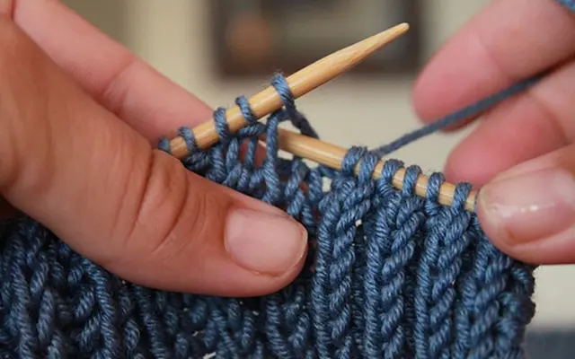

# Đan len (Knitting)

Đan len (trong tiếng anh được gọi là knit) là một phương pháp đan xen các vòng len hoặc bất kỳ một loại sợi khác bằng các que đan và đôi khi một số nơi sẽ dùng máy để thay thế. Sản phẩm được hình thành từ nhiều vòng sợi dạng ống hoặc dạng đường và được gọi là khâu. 

[*src*](https://pinkyhandmade.com/blog/tip-phan-biet-dan-len-va-moc-len-khong-phai-ai-cung-biet)

## Nguồn học

### Khởi đầu

[Hướng Dẫn Học Đan Len Cơ Bản](https://www.youtube.com/playlist?list=PLF9D32dQeg8n43TmNaj_TYduIHscxqiXP)

### Bài hướng dẫn

- [[Hướng dẫn DIY] Tự đan/móc mũ len tại nhà](https://spiderum.com/bai-dang/Huong-dan-DIY-Tu-danmoc-mu-len-tai-nha-53l?comment=61155)
- [Chẳng cần que đan bạn cũng đan được khăn len chỉ với...1 chiếc hộp](https://spiderum.com/bai-dang/Chang-can-que-dan-ban-cung-dan-duoc-khan-len-chi-voi1-chiec-hop-377)

### Sách học

Lười quá chưa tìm