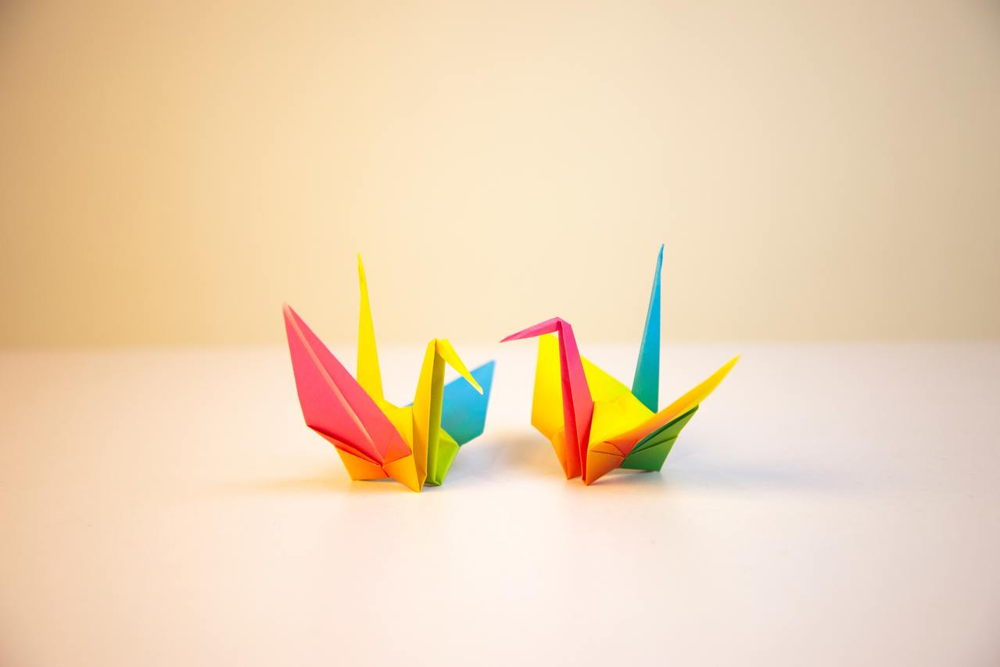

# Origami

## Giới thiệu

Origami (折り紙) là gì? Origami là nghệ thuật gấp giấy của Nhật Bản.

*Tính thêm lịch sử phát triển vào nhưng mà lười quá. Mọi người tự đọc thêm trong bài [ORIGAMI và những tác dụng nghệ thuật](https://spiderum.com/bai-dang/ORIGAMI-va-nhung-tac-dung-nghe-thuat-10xq) nhé!*

## Hướng dẫn học

### Nhập môn

Mình không tìm được một hướng dẫn hoàn chỉnh nào bằng Tiếng Việt nên mình xin phép để hướng dẫn từ [Origami Tutorials của r/Origami](https://old.reddit.com/r/origami/wiki/tutorials) ở đây.

### Sản phẩm/Ý tưởng

Bạn có thể xem thêm trong các kênh sau:

[Nghệ Thuật ORIGAMI](https://www.youtube.com/c/Ngh%E1%BB%87Thu%E1%BA%ADtORIGAMI) - Cực nhiều sản phẩm.

Cũng như danh sách các cơ sở dữ liệu Origami khác (bằng Tiếng Anh)

- <http://www.ultimateorigami.net/origami-diagrams#>
- <https://www.origami.org/>
- <http://www.origamidatabase.com/>
- <http://www.reddit.com/r/origami/wiki/index#wiki_diagrams>
