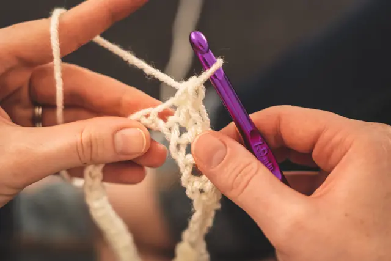

# Móc len (Crochet)

Móc len (trong tiếng anh được gọi là Crochet), phương pháp này đã được xuất hiện rất lâu từ trước và dường như được xem là một bộ môn nghệ thuật. Từ crochet xuất phát từ trong tiếng Pháp và có nghĩa là “cây móc nhỏ”, cây móc được sử dụng trong móc len thường được làm bằng nhựa cứng, hay gỗ với đầu móc thường gặp là kim loại, và chúng có nhiều kích thước đầu móc khác nhau, tùy thuộc vào sản phẩm mà bạn định móc bạn sẽ lựa chọn cây móc phù hợp.

 ([*src*](https://pinkyhandmade.com/blog/tip-phan-biet-dan-len-va-moc-len-khong-phai-ai-cung-biet))

## Hướng dẫn học

### Cơ bản

[Học móc len căn bản - Crochet Basic](https://www.youtube.com/playlist?list=PLrkQvebp4B3a2x2AAi49SoyISuPmG_2Se)

### Sản phẩm/Ý tưởng

- [Móc Len Móc Khoá Lá Cờ Việt Nam](https://www.youtube.com/watch?v=ddGfwAndtfk)
- [Móc Len Móc Khoá Cá Đuối](https://www.youtube.com/watch?v=OyeO17lEuJM)
- [Hướng dẫn cách móc cỏ 4 lá bằng len đơn giản nhất](https://www.youtube.com/watch?v=980gFtQkOoA)
- [Móc Len Móc Khoá Ngựa Pony](https://www.youtube.com/watch?v=MJEeU1W6l5E)
- [Móc Len Con Ếch](https://www.youtube.com/watch?v=qoGvrV9hKTE)

### Sách học

Lười quá chưa tìm

### Tài nguyên bằng Tiếng Anh

- [r/Crochet's Wiki](https://old.reddit.com/r/crochet/wiki/index) - Yep, xịn khỏi bàn
- [Where should an absolute beginner start with learning how to crochet?](https://old.reddit.com/r/crochet/comments/p7f703/where_should_an_absolute_beginner_start_with/)