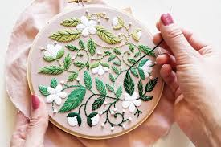

# Thêu

## Giới thiệu

Thêu còn được hiểu là nghề dệt trang trí trên vải hoặc dùng các vật liệu khác như kim để may họa tiết qua các sợi chỉ hoặc sợi len (Nguồn: Wikipedia).

## Hướng dẫn học

### Nhập môn

[NHẬP MÔN THÊU THÙA: HƯỚNG DẪN CHI TIẾT 8 MŨI THÊU CƠ BẢN NHẤT - 8 Basic stitches for beginner](https://www.youtube.com/watch?v=_J87Rdtp7Rg)

Bạn có thể xem đầy đủ danh sách hướng dẫn [Nhập môn thêu thùa](https://www.youtube.com/playlist?list=PLeByI-MWcpnFkreRc8NybpsumDytNJ5Fh) (Các video được sắp xếp khá lộn xộn)

### Danh sách phát trên Youtube

- [16 mũi thêu cơ bản cho người mới bắt đầu](https://youtube.com/playlist?list=PLeByI-MWcpnEuaWEIb_-clEwrueCpDhYK&si=plOmsmVrpXJE-JMo)
- [Học thêu tay](https://www.youtube.com/playlist?list=PLYvzIAZx3VuIRWS_pOqGyglPtGHS5j_AY)
- [Học thêu tay truyền thống](https://www.youtube.com/playlist?list=PLgSaDn8Plm1G2KiWqTb0ok_LE99WFm-fX)